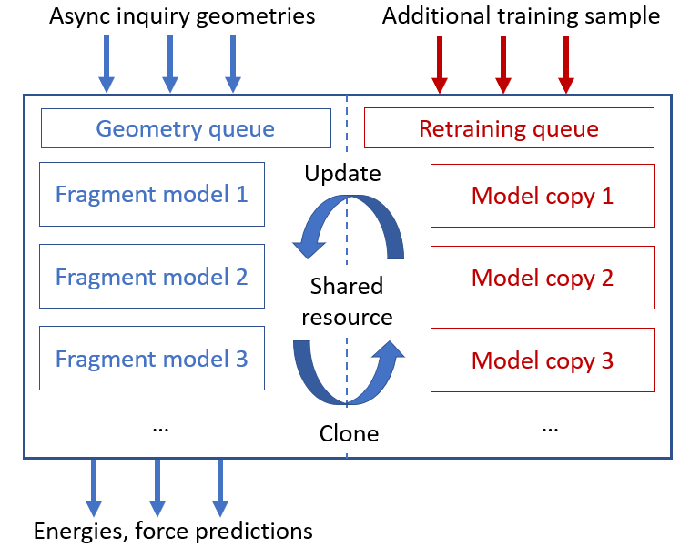

# Online ML server for molecular dynamics speed up

Currently developing package.

An independent client-server style prediction architecture in which an online ML server provides asynchronous force predictions and model versioning. The server operates independently of the molecular dynamics engine and supports multiple concurrent simulations, facilitating scalable deployment, centralized model management, and efficient reuse of learned representations.

## Launch on HPC
1. Edit server connection and communication settings in
'''
transfer_server/server.toml
'''
2. Edit resource configuration for server submitted as a batch job
'''
transfer_server/launch_server.script
'''
3. Submit job in transfer_server
'''
sbatch launch_server.script
'''
or directly run nn_host.py in interactive section
'''
python nn_host.py
'''
